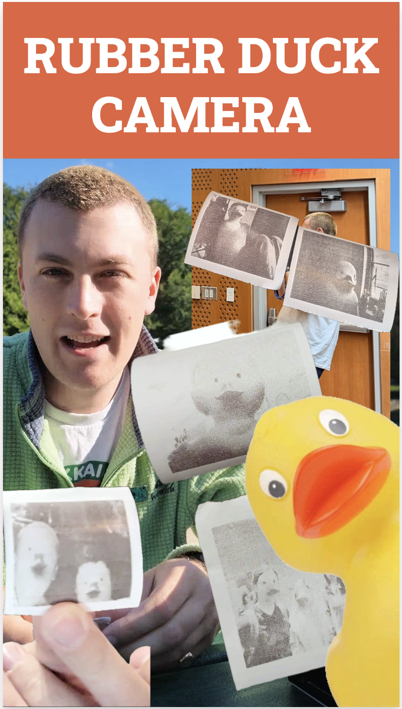
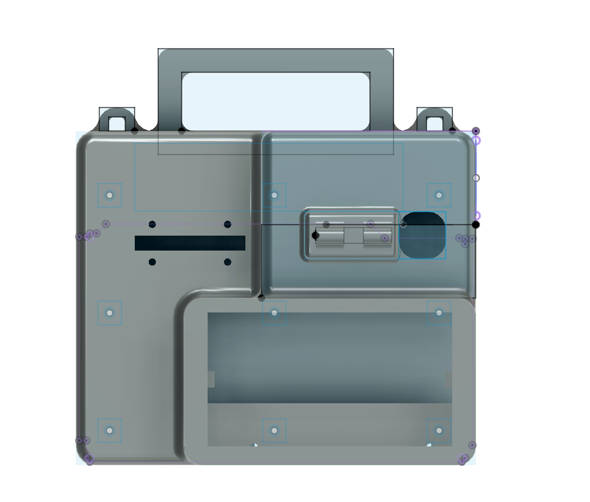
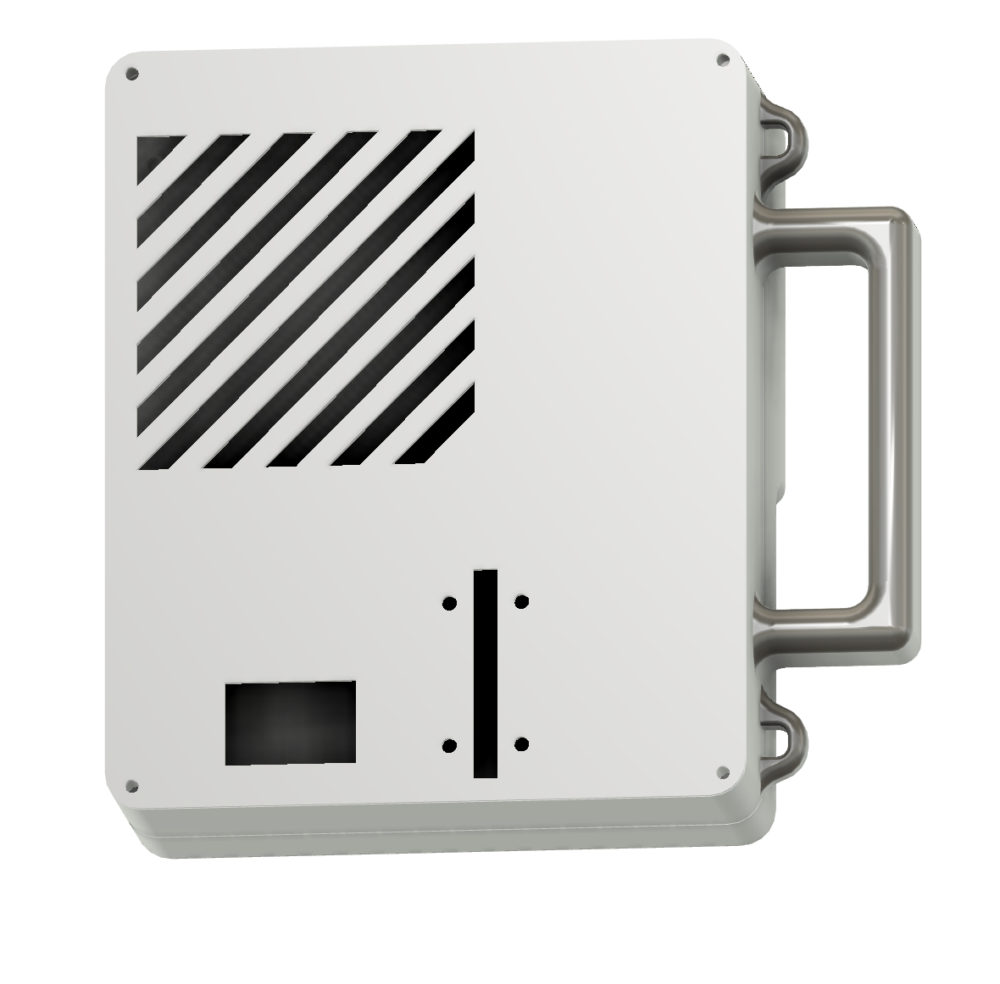
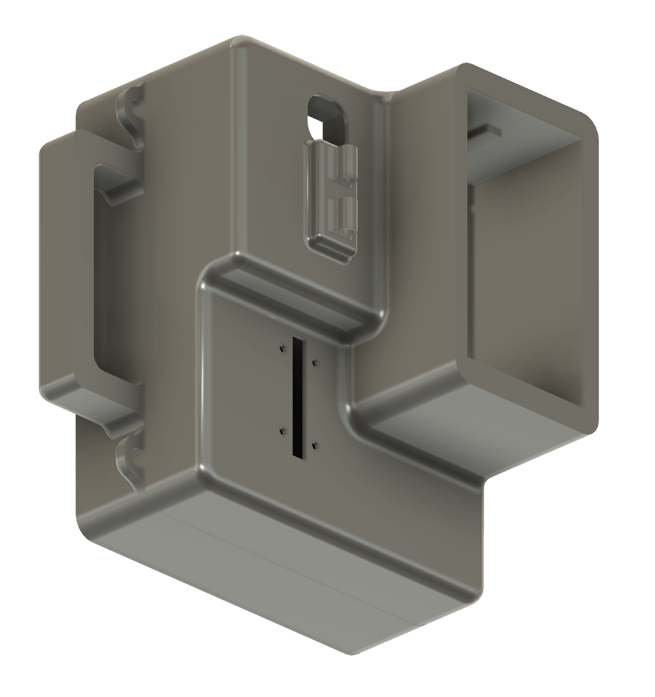
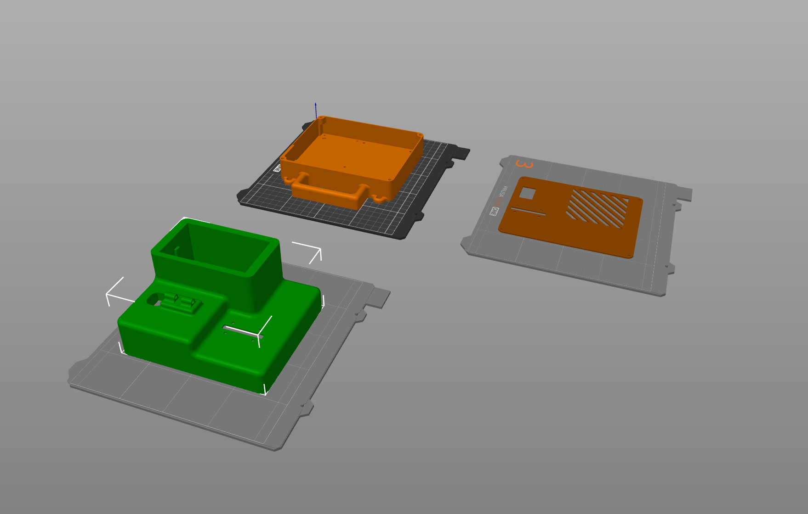

# VENTUNO Q Instant Camera



A headless instant-camera photobooth for the Arduino VENTUNO Q. It combines a USB webcam, Modulino Buttons and Pixels, the onboard LED matrix, a serial thermal printer, local VLM descriptions, and optional local NPU or cloud image editing.

## What it does

- Six configurable short/long button profiles across Normal, Local NPU, Cloud, and Describe modes.
- Captures, edits, archives, and prints 384-dot monochrome receipts.
- Provides a browser UI on port 7000 for configuration, previews, test prints, and history.
- Provisions Wi-Fi from an Android sharing QR code without a display.
- Runs the local editor through QNN/HTP contexts compiled for the VENTUNO Q QCS8275.

## Hardware

- Arduino VENTUNO Q with a current App Lab image and `arduino-app-cli`.
- UVC USB webcam.
- Modulino Buttons and Modulino Pixels connected over Qwiic/I2C.
- TTL thermal printer on D1/TX at 9600 baud, powered by the dedicated 9 V output of the USB-C PD trigger and sharing ground with the VENTUNO Q.

See the [hardware build guide](hardware/README.md) for assembly and wiring, and [the app README](ArduinoApps/instant-me-camera/README.md) for controls and operation.

### Bill of materials

| Component | Quantity |
| --- | ---: |
| [USB C PD 9V trigger adapter](https://m.media-amazon.com/images/I/71KljqwlDBL._AC_SX679_.jpg) | 1 |
| USB-C panel-mount extension cable | 1 |
| Anker USB-C power bank | 1 |
| [Modulino Buttons](https://cdn.shopify.com/s/files/1/0438/4735/2471/files/ABX00110_01.iso.jpg?v=1747144627) | 1 |
| [Snap-in spacers for Modulino boards and VENTUNO Q](https://media.rs-online.com/image/upload/bo_1.5px_solid_white,b_auto,c_pad,dpr_2,f_auto,h_399,q_auto,w_710/c_pad,h_399,w_710/F0304193-01?pgw=1) | 14 |
| [CSN-A2 58mm thermal printer](https://thepihut.com/cdn/shop/files/mini-thermal-receipt-printer-the-pi-hut-105116-40741308137667_1000x.jpg?v=1691059814) | 1 |
| [Modulino Pixels](https://cdn.shopify.com/s/files/1/0438/4735/2471/files/ABX00109_01.iso.jpg?v=1747144631) | 1 |
| M3 x 5 mm heat-set inserts | 4 |
| [Logitech C270 webcam](https://m.media-amazon.com/images/I/61yo4swj-PL._AC_SX679_.jpg) | 1 |
| [40 colored male-to-male jumper wires](https://cdn.shopify.com/s/files/1/0438/4735/2471/files/TPX00160_00.default_6a832518-bf2a-406c-a2d1-a554b9949905.jpg?v=1771603253) | 1 pack |
| 15 cm solid-core hookup wires | 2 |
| [Arduino VENTUNO Q](https://cdn.shopify.com/s/files/1/0438/4735/2471/files/ABX00181_01.iso.jpg?v=1784300672) | 1 |
| M3 x 5 mm caphead screws | 4 |
| [Qwiic cable bundle](https://cdn.shopify.com/s/files/1/0438/4735/2471/files/TPX00232_01.iso.jpg?v=1755589661) | 1 bundle |

## 3D-printed enclosure

The enclosure is a three-part print sized around the VENTUNO Q, webcam, thermal printer, and Modulino boards: a top shell with the carry handle and camera/button cutouts, a bottom shell with a printer bay, and a vented side panel for airflow around the board.

| Front cutouts | Vented side panel | Interior shell |
| --- | --- | --- |
|  |  |  |

Use this layout for printing; supports are required for the front plate:



Download the [3MF enclosure file](hardware/ventuno-q-instant-camera.3mf) for all three parts. See the [hardware build guide](hardware/README.md) for the assembly sequence.

Tested on a Prusa Core One+

## Install on a VENTUNO Q

The installer is intended to run on the VENTUNO Q. It downloads about 3.1 GB of
compressed NPU runtime/model artifacts from Hugging Face, installs roughly 6 GB,
and needs at least 8 GB free during installation. Model downloads are public and
do not require a Hugging Face account.

```bash
git clone https://github.com/jimbruges/ventuno-q-instant-camera.git
cd ventuno-q-instant-camera
./install.sh
```

The installer:

1. Verifies that it is running on a VENTUNO Q.
2. Copies the Arduino App to `~/ArduinoApps/instant-me-camera`.
3. Downloads and checksum-verifies the pinned Hugging Face `v1` model bundle.
4. Installs the portable NPU and Wi-Fi user services.
5. Enables both services, sets the app as the boot default, and starts it.

Then open `http://<board-ip>:7000`. The first NPU startup may take up to two minutes.

Useful alternatives:

```bash
./install.sh --skip-models   # Normal, Cloud, and Describe modes only
./install.sh --no-start      # Install without starting or changing the default app
./scripts/install-models.sh  # Install/reinstall only the local NPU bundle
```

The installer preserves runtime `config.json`, `.secrets.json`, captures, and profile photos on upgrades.

## Configuration

The app works without `config.json`; defaults are portable and discover the Docker host gateway automatically. To customize settings manually:

```bash
cp ~/ArduinoApps/instant-me-camera/config.example.json \
   ~/ArduinoApps/instant-me-camera/config.json
```

Cloud mode needs an OpenRouter API key entered in the Web UI. It is stored in the ignored, owner-only `.secrets.json` file and is never committed.

## Models and large files

Model files are not stored in Git history. The supported bundle is distributed
as checksummed artifacts from a dedicated Hugging Face model repository. This
keeps source clones small while pinning the exact ARM64 runtime and QCS8275
contexts.

See [MODELS.md](MODELS.md) for artifact contents, upstream model licenses, and installation details.

## Repository layout

- `ArduinoApps/instant-me-camera/`: App Lab application, MCU sketch, Web UI, and Wi-Fi helper.
- `instant-camera-ai/src/`: local QNN inference pipeline.
- `instant-camera-ai/bin/start-npu-router`: portable NPU service launcher.
- `instant-camera-ai/systemd/`: user service template.
- `scripts/install-models.sh`: release artifact downloader and verifier.
- `install.sh`: complete board installer.
- `hardware/`: 3D-printable enclosure source (`.3mf`) and build instructions.
- `docs/images/`: README screenshots and renders.

## Operations

```bash
systemctl --user status instant-camera-npu.service
systemctl --user status instant-camera-wifi.service
curl http://127.0.0.1:7100/health
arduino-app-cli app logs ~/ArduinoApps/instant-me-camera --tail 100
arduino-app-cli app start ~/ArduinoApps/instant-me-camera
```

Only one Arduino App can run at a time. Starting this app stops the currently running app.
